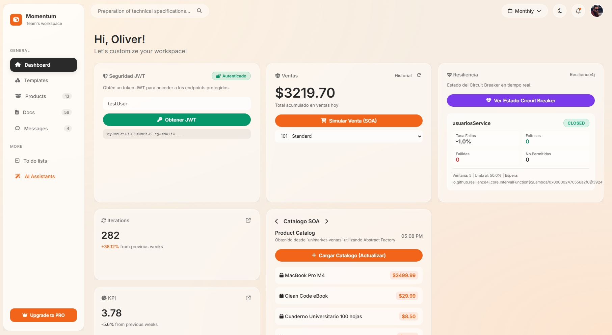

# 🏪 UniMarket-2 — Plataforma de Microservicios SOA

> **Arquitectura Orientada a Servicios (SOA)** con microservicios RESTful, resiliencia (Circuit Breaker + Retry + Fallback), seguridad JWT, observabilidad distribuida y patrones de diseño (Strategy, Abstract Factory).

---

## 🏛️ Arquitectura del Sistema

UniMarket-2 implementa una **Arquitectura Orientada a Servicios (SOA)** con comunicación REST síncrona entre dos microservicios independientes:

| Componente | Tecnología | Puerto | Rol |
|:-----------|:-----------|:-------|:----|
| **Frontend** | Vite + Vanilla JS | `:5173` | SPA dashboard: Auth JWT, Ventas, Catálogo, Circuit Breaker |
| **unimarket-ventas** | Spring Boot 4 | `:8081` | **Consumidor SOA** — Ventas, Strategy Pattern, Resilience4j, JWT |
| **unimarket-usuarios** | Spring Boot 4 | `:8080` | **Proveedor SOA** — Validación de usuarios, perfiles |
| **Prometheus** | Docker | `:9090` | Recolección de métricas (scrape cada 3s) |
| **Grafana** | Docker | `:3000` | Dashboards de visualización |
| **Jaeger** | Docker | `:16686` | Tracing distribuido (OTLP) |

### Aspectos Arquitectónicos Clave

- **Comunicación REST**: `unimarket-ventas` consume a `unimarket-usuarios` vía `RestClient` con propagación automática de trazas (W3C Trace Context).
- **Resiliencia**: Circuit Breaker (Resilience4j) + Retry (3 intentos, 2s entre cada uno) + Fallback (perfil STANDARD por defecto). El sistema **nunca falla**, degrada gracefully.
- **Seguridad**: JWT (HS256) con Spring Security — endpoints protegidos (`/api/ventas/crear`, `/api/ventas/historial/**`) y endpoints públicos (`/api/auth/**`, `/api/productos/**`, `/actuator/**`).
- **Observabilidad**: Métricas (Micrometer → Prometheus → Grafana) + Trazas distribuidas (OpenTelemetry → OTLP → Jaeger).
- **Patrones de Diseño**: Strategy (comisiones según perfil), Abstract Factory (catálogo de productos).

---

## 🖥️ Interfaz del Frontend

El frontend es una SPA tipo dashboard que permite interactuar con todos los componentes de la arquitectura desde una interfaz unificada:



El dashboard se divide en 4 módulos principales:
- **🔒 Seguridad JWT**: Obtener token de autenticación para acceder a endpoints protegidos.
- **🛒 Ventas (SOA)**: Simular ventas que disparan la comunicación inter-servicio, el Strategy Pattern y el Circuit Breaker.
- **📦 Catálogo SOA**: Cargar productos generados por el Abstract Factory.
- **💚 Resiliencia**: Visualizar el estado del Circuit Breaker (`CLOSED`, `OPEN`, `HALF_OPEN`) y sus métricas en tiempo real.

---

## 📖 Wiki — Documentación a Profundidad

> La documentación completa del proyecto se encuentra en la **[📚 Wiki del repositorio](../../wiki)**, donde se abordan en profundidad los siguientes temas:

| Sección | Descripción |
|:--------|:------------|
| **Descripción del Sistema** | Contexto, objetivos y alcance de UniMarket |
| **Arquitectura Inicial vs. Evolucionada** | Evolución de monolito a microservicios SOA |
| **Resiliencia** | Circuit Breaker, Retry, Fallback — investigación e implementación |
| **Observabilidad** | Stack Prometheus + Grafana + Jaeger — configuración y evidencia |
| **Seguridad** | JWT, Spring Security — flujo de autenticación y protección de endpoints |
| **Diagramas Arquitectónicos** | C4 Contenedores, Secuencia UML, Topología de Observabilidad |
| **Evidencia de Funcionalidades** | Screenshots, trazas, métricas para cada endpoint cubierto |

---

## 🚀 Requisitos Previos

- **Java 21** o superior.
- **Node.js** (para el frontend).
- **Docker Desktop** (para la infraestructura de monitoreo).
- **Maven** (incluido mediante `./mvnw`).

---

## 🛠️ Paso 1: Iniciar la Infraestructura (Docker)

Primero, debemos iniciar los servicios de soporte (Jaeger, Prometheus, Grafana).

```powershell
docker-compose up -d
```

### Servicios Disponibles:
- **Jaeger UI**: [http://localhost:16686](http://localhost:16686) (Para ver las trazas distribuidas).
- **Prometheus**: [http://localhost:9090](http://localhost:9090).
- **Grafana**: [http://localhost:3000](http://localhost:3000) (User: `admin` / Pass: `admin`).

---

## 🟢 Paso 2: Iniciar los Microservicios (Backend)

Debes ejecutar cada microservicio en una terminal separada.

### 1. Microservicio de Usuarios (Puerto 8080)
Este servicio maneja la información de los perfiles y validación de existencia.

```powershell
cd unimarket-usuarios
./mvnw spring-boot:run
```

### 2. Microservicio de Ventas (Puerto 8081)
Este servicio gestiona las ventas y aplica el **Pattern Strategy** según el tipo de usuario obtenido desde el servicio de usuarios.

```powershell
cd unimarket-ventas
# Si hay cambios en el código, compila primero:
./mvnw clean compile
# Ejecuta:
./mvnw spring-boot:run
```

---

## 💻 Paso 3: Iniciar el Frontend

El frontend simula la interacción del usuario final.

```powershell
cd unimarket-frontend
npm install
npm run dev
```
Accede a la URL indicada (usualmente [http://localhost:5173](http://localhost:5173)).

---

## 📜 Comandos Útiles de Mantenimiento

| Acción | Comando | Directorio |
| :--- | :--- | :--- |
| Detener Docker | `docker-compose down` | Raíz del proyecto |
| Reconstruir Ventas | `./mvnw clean package` | `unimarket-ventas` |
| Limpiar Node Modules | `rm -rf node_modules` | `unimarket-frontend` |
| Matar proceso en puerto (Windows) | `Stop-Process -Id (Get-NetTCPConnection -LocalPort <PUERTO>).OwningProcess -Force` | Cualquier terminal |

---

## 🔍 Observabilidad y Tracing (Jaeger)

Para verificar que el flujo de microservicios está funcionando correctamente (gráfico escalonado):
1. Inicia todos los servicios.
2. Realiza una venta desde el **Frontend**.
3. Ve a [Jaeger UI](http://localhost:16686).
4. Selecciona `unimarket-ventas` en la lista de servicios.
5. Haz clic en **Find Traces**.
6. Abre la traza correspondiente para ver la jerarquía de llamadas.
